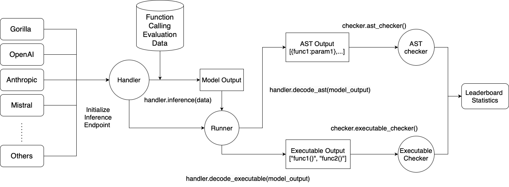

<div align="center">
<h1>Berkeley Function Calling Leaderboard (BFCL)</h1>

<p align="center">
    <a href="https://huggingface.co/datasets/gorilla-llm/Berkeley-Function-Calling-Leaderboard">🤗 Dataset</a> • 
    <a href="https://gorilla.cs.berkeley.edu/leaderboard.html">🏆 Leaderboard</a> •   
    <a href="https://gorilla.cs.berkeley.edu/blogs/8_berkeley_function_calling_leaderboard.html">📰 Blog</a>
</p>

</div>


## Introduction
We present Berkeley Function Leaderboard, the **first comprehensive and executable function calling evaluation for LLMs function calling**. Different from prior function calling evaluations (e.g. Anyscale function calling blog), we consider function callings of various forms, different function calling scenarios, and the executability of function calls. We also release our model [gorilla-openfunctions-v2](https://huggingface.co/gorilla-llm/gorilla-openfunctions-v2), the best open-source models so far to handle multiple languages of function calls, parallel function calls and multiple function calls. We also provide a specific debugging feature that when the provided function is not suitable for your task, the model will output an “Error Message”. 

Read more about the technical details and interesting insights in our blog post!



## Get started

Create a `.env` file similar to the [.env.example](.env.example) file, and fill out the values for the variables you wish to use for either open-source or proprietary LLM generation and evaluation.

### 🚀 Installation

> [!Tip]
> Ensure that you are using the latest versions of `setuptools`, `wheel`, and `pip` to avoid any installation issues. Run:
> ```bash
> pip install --upgrade setuptools wheel pip
> ```

To install the `bfcl` package from the GitHub repository, run:
```bash
$ git clone https://github.com/ShishirPatil/gorilla
$ cd berkeley-function-call-leaderboard
$ pip install -e .
```

Extras dependencies can be installed via:
```bash
pip install -e ".[NAME]"
```
| Name              | Use                                                      |
|-------------------|----------------------------------------------------------|
| oss_eval          | For LLM generation and evaluation using open source models |
| proprietary_eval  | For LLM generation and evaluation using proprietary models |
| all               | Loads all extras (not recommended)                       |

#### OSS eval

We use [vllm](https://docs.vllm.ai/en/latest/index.html) to perform offline LLM inference. Installation of [vllm](https://docs.vllm.ai/en/latest/getting_started/installation.html#requirements) requires installing a CUDA-compatible PyTorch version. You can run the following command:
```bash
# Replace the CUDA version "cu118" according to your system.
# See available CUDA versions at https://pytorch.org/get-started/locally/
# bfcl currently uses `v0.5.1` of vllm and it requires torch `v2.3.0`
$ pip install torch==2.3.0 --index-url https://download.pytorch.org/whl/cu118
$ pip install -e ".[oss_eval]"
```

#### Proprietary eval

To install dependencies for proprietary model evaluation, run:
```bash
pip install -e ".[proprietary_eval]"
```

## User Guide

A comprehensive user guide detailing the full list of supported arguments is available [here](./bfcl/cli.py) and can also be accessed on the terminal by calling:
```bash
bfcl -h
```
```text
usage: bfcl [-h] {llm_generation,evaluation} ...       

Berkeley Function Calling Leaderboard (BFCL)

positional arguments:
  {llm_generation,evaluation}
                        Sub-command to run
    llm_generation      Collect LLM responses
    evaluation          Run evaluation

options:
  -h, --help            show this help message and exit
```

### LLM Generation

To view the full list of arguments for the LLM generation sub-command, call:
```bash
bfcl llm_generation -h
```

#### Open Source Models

To perform generation on an open-weights model (e.g. [google/gemma-7b-it](https://huggingface.co/google/gemma-7b-it)) for the `ast` test group, use the following command:
```bash
bfcl llm_generation \
    --model google/gemma-7b-it \
    --model_type oss \
    --test-group ast
```

To provide sampling parameters, you can use:
```bash
bfcl llm_generation \
    --model google/gemma-7b-it \
    --model_type oss \
    --test-group ast \
    --temperature 0.7 \
    --top-p 1 \
    --max-tokens 1000
```

To specify multiple test categories:
```bash
bfcl llm_generation \
    --model google/gemma-7b-it \
    --model_type oss \
    --test-categories rest,java,javascript
```

#### Proprietary Models

To perform generation on a proprietary/hosted model (e.g. [gorilla-openfunctions-v2](https://huggingface.co/gorilla-llm/gorilla-openfunctions-v2)) for the `executable` test group, use:
```bash
bfcl llm_generation \
    --model gorilla-openfunctions-v2 \
    --model_type proprietary \
    --test-group executable
```

To specify multiple test categories:
```bash
bfcl llm_generation \
    --model gorilla-openfunctions-v2 \
    --model_type proprietary \
    --test-categories relevance,multiple_function,parallel_function
```

### Evaluation

To view the full list of arguments for the evaluation sub-command, call:
```bash
bfcl evaluation -h
```

To perform evaluation of a proprietary/hosted model (e.g. [gorilla-openfunctions-v2](https://huggingface.co/gorilla-llm/gorilla-openfunctions-v2)) on all the test categories, use:
```bash
bfcl evaluation \
    --model gorilla-openfunctions-v2 \
    --model_type proprietary \
    --test-group all
```

#### Executable Test Category Evaluation

To run the executable test categories, you need to provide the following API keys in the `.env` file:
```ini
RAPID_API_KEY=
EXCHANGERATE_API_KEY=
OMDB_API_KEY=
GEOCODE_API_KEY=
```
You can use the following links to obtain the API keys:
1. Rapid API: https://rapidapi.com/hub
    * Yahoo Finance: https://rapidapi.com/sparior/api/yahoo-finance15
    * Real Time Amazon Data : https://rapidapi.com/letscrape-6bRBa3QguO5/api/real-time-amazon-data
    * Urban Dictionary: https://rapidapi.com/community/api/urban-dictionary
    * Covid 19: https://rapidapi.com/api-sports/api/covid-193
    * Time zone by Location: https://rapidapi.com/BertoldVdb/api/timezone-by-location

    All the Rapid APIs we use have free tier usage. As a result, you need to subscribe to those API providers in order to have the executable test environment setup but it will be free of charge!
2. ExchangeRate API: https://www.exchangerate-api.com
3. OMDB API: http://www.omdbapi.com/apikey.aspx
4. Geocode API: https://geocode.maps.co/