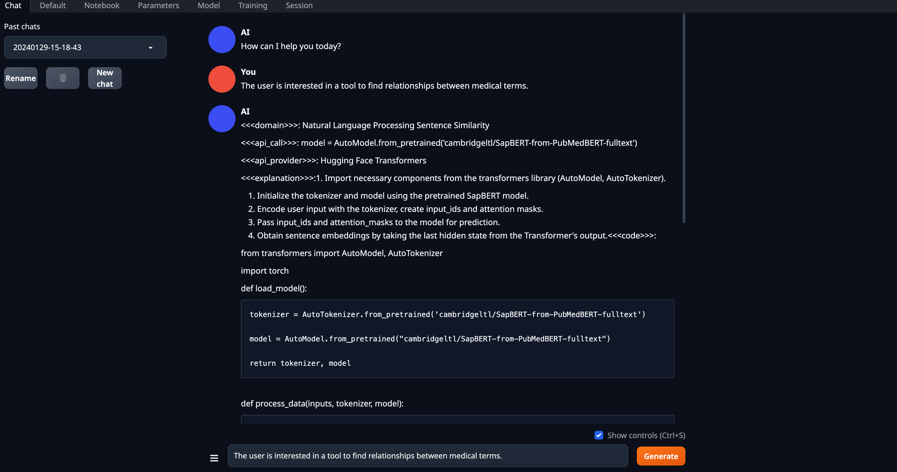

# Gorilla Inference


## Get Started

You can either run Gorilla through our hosted [](https://colab.research.google.com/drive/1DEBPsccVLF_aUnmD0FwPeHFrtdC0QIUP?usp=sharing) or [chat with it using cli](#inference-using-cli). We also provide instructions for [evaluating batched prompts](#optional-batch-inference-on-a-prompt-file). Here, are the instructions to run it locally.

New: We release `gorilla-mpt-7b-hf-v0` and `gorilla-falcon-7b-hf-v0` - two Apache 2.0 licensed models (commercially usable). 

`gorilla-7b-hf-v0` is the first set of weights we released :tada: It chooses from 925 HF APIs in a 0-shot fashion (without any retrieval). Update: We released `gorilla-7b-th-v0` with 94 (exhaustive) APIs from Torch Hub and `gorilla-7b-tf-v0` with 626 (exhaustive) APIs from Tensorflow. In spirit of openess, we do not filter, nor carry out any post processing either to the prompt nor response :gift: Keep in mind that the current `gorilla-7b-*` models do not have any geenric chat capability.  We do have a model with all the 1600+ APIs which also has chat capability, which we release slowly to accommodate server demand. 

All gorilla weights hosted at [https://huggingface.co/gorilla-llm/](https://huggingface.co/gorilla-llm/). 

### Install Dependencies

You should install dependencies using the following command: 

```bash
conda create -n gorilla python=3.10
conda activate gorilla
pip install -r requirements.txt
```

We release the weights for [`gorilla-mpt-7b-hf-v0`](https://huggingface.co/gorilla-llm/gorilla-mpt-7b-hf-v0) and [`gorilla-falcon-7b-hf-v0`](https://huggingface.co/gorilla-llm/gorilla-falcon-7b-hf-v0) on Huggingface. You can directly download them! For the llama-finetuned models we release the weights as a delta to be compliant with the LLaMA model license. You can apply the delta weights using the following commands below: 

### Downloading Gorilla Delta Weights

We release the delta weights of Gorilla to comply with the LLaMA model license. You can prepare the Gorilla weights using the following steps: 

1. Get the original LLaMA weights using the link [here](https://huggingface.co/docs/transformers/main/model_doc/llama). 
2. Download the Gorilla delta weights from our [Hugging Face](https://huggingface.co/gorilla-llm/gorilla-7b-hf-delta-v0).

### Applying Delta Weights

Run the following python command to apply the delta weights to your LLaMA model: 

```python
python3 apply_delta.py 
--base-model-path path/to/hf_llama/ 
--target-model-path path/to/gorilla-7b-hf-v0 
--delta-path path/to/models--gorilla-llm--gorilla-7b-hf-delta-v0
```

### Inference using CLI

Simply run the command below to start chatting with Gorilla: 

```bash 
python3 serve/gorilla_cli.py --model-path path/to/gorilla-7b-{hf,th,tf}-v0
```

For the falcon-7b model, you can use the following command: 

```bash
python3 serve/gorilla_falcon_cli.py --model-path path/to/gorilla-falcon-7b-hf-v0
```

> Add "--device mps" if you are running on your Mac with Apple silicon (M1, M2, etc)

### Inference Gorilla locally

K-quantized gorilla models can be found on [Huggingface](https://huggingface.co/gorilla-llm): [Llama-based](https://huggingface.co/gorilla-llm/gorilla-7b-hf-v1-gguf), [MPT-Based](https://huggingface.co/gorilla-llm/gorilla-mpt-7b-hf-v0-gguf), [Falcon-Based](https://huggingface.co/gorilla-llm/gorilla-falcon-7b-hf-v0-gguf)

K-quantized `gorilla-openfunctions-v0` and `gorilla-openfunctions-v1` models can be found on [Huggingface](https://huggingface.co/gorilla-llm): [`gorilla-openfunctions-v0-gguf`](https://huggingface.co/gorilla-llm/gorilla-openfunctions-v0-gguf), [`gorilla-openfunctions-v1-gguf`](https://huggingface.co/gorilla-llm/gorilla-openfunctions-v1-gguf)

For an in depth walkthrough on how this quantization was done, follow the tutorial in 
this [](https://colab.research.google.com/drive/1JP_MN-J1rODo9k_-dR_9c9EnZRCfcVNe?usp=sharing). This tutorial is a fully self-contained space to see an under-the-hood walkthrough of the quantization pipeline (using llama.cpp) and to test out your own prompts with different quantized versions of Gorilla. The models don't take up local space and utilize a CPU runtime. 

Running local inference with Gorilla on a clean interface is simple. Follow the instructions below to set up [text-generation-webui](https://github.com/oobabooga/text-generation-webui), add your desired models, and run inference. 


My specs, M1 Macbook Air 2020
```
  Model Name: MacBook Air
  Model Identifier:	MacBookAir10,1
  Model Number:	Z125000NMCH/A
  Chip:	Apple M1
  Total Number of Cores: 8 (4 performance and 4 efficiency)
  Memory: 16 GB
  System Firmware Version: 10151.61.4
  OS Loader Version: 10151.61.4
```

Step 1: Clone [text-generation-webui](https://github.com/oobabooga/text-generation-webui), a Gradio web UI for Large Language Models. It supports transformers, GPTQ, AWQ, EXL2, llama.cpp (GGUF), and Llama models. It hides many complexities of llama.cpp and has a well defined interface that is easy to use.

`git clone https://github.com/oobabooga/text-generation-webui.git`

Step 2: Follow [text-generation-webui](https://github.com/oobabooga/text-generation-webui) instructions to run the application locally.
1. Go to the cloned folder
2. `./start_macos.sh` and it will output the following 
3. Open a browser and go to url `http://127.0.0.1:7860/` as an example. 


Step 3: Select the quantization method you want to use, download the quantized model and run the inference on the quantized Gorilla models. 

1. Here, we can go to `Model` and there is `Download model or LoRA`. For example, we want to get the q3_K_M gguf quantized model for `gorilla-7b-hf-v1`, you would input `gorilla-llm/gorilla-7b-hf-v1` and filename as `gorilla-7b-hf-v1-q3_K_M` and click `Download`. It would say Downloading file to `models/`. 
2. After downloading the model, you select the Model, `gorilla-7b-hf-v1-q3_K_M` for demonstration, and click `Load`. For settings, if you have laptop GPU available, increasing `n-gpu-layers` accelerates inference. 
3. After loading, it will give a confirmation message as following. 
4. Then go to `Chat` page, use default setting for llama based quantized models, 
5. *Real-time inference* video demo


Integration with Gorilla-CLI coming soon ...

### [Optional] Batch Inference on a Prompt File

After downloading the model, you need to make a jsonl file containing all the question you want to inference through Gorilla. Here is [one example](https://github.com/ShishirPatil/gorilla/blob/main/inference/example_questions/example_questions.jsonl): 

```
{"question_id": 1, "text": "I want to generate image from text."}
{"question_id": 2, "text": "I want to generate text from image."}
```

After that, using the following command to get the results: 

```bash
python3 gorilla_eval.py --model-path path/to/gorilla-7b-hf-v0
--question-file path/to/questions.jsonl
----answer-file path/to/answers.jsonl
```

You could use your own questions and get Gorilla responses. We also provide a set of [questions](https://github.com/ShishirPatil/gorilla/tree/main/eval/eval-data/questions/huggingface) that we used for evaluation.
